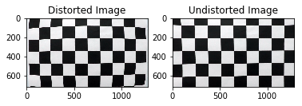
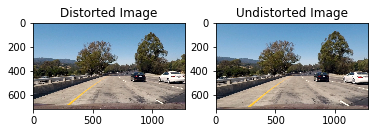
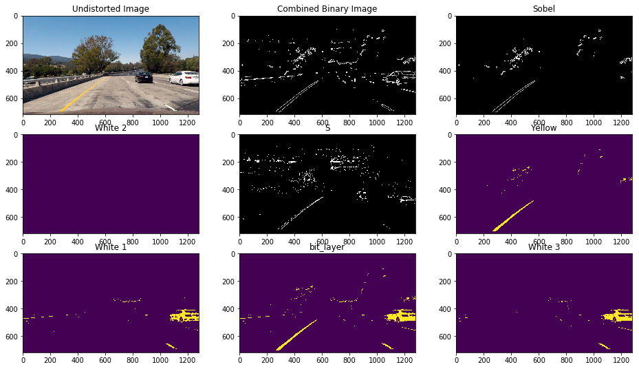
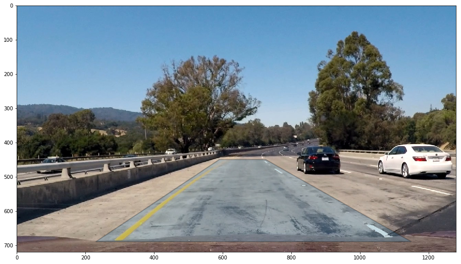
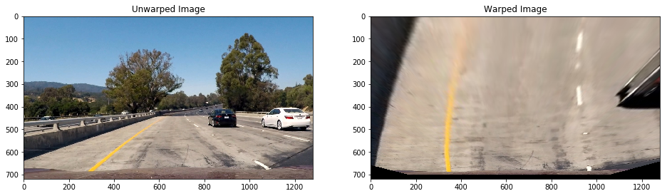
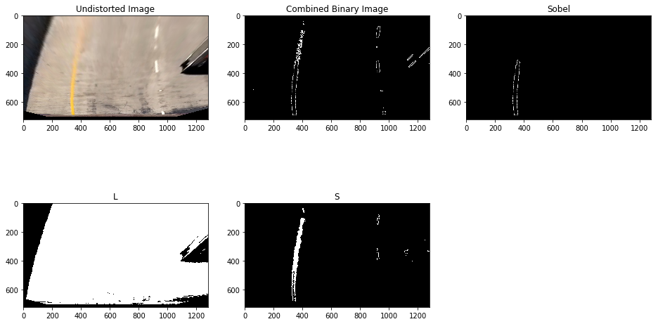
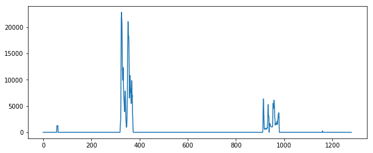
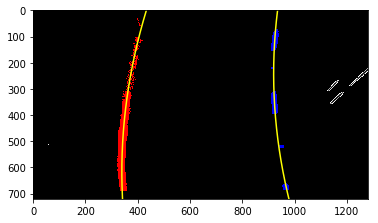
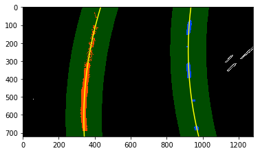
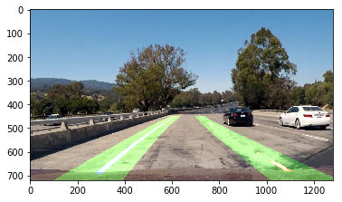

## Advanced Lane Finding Project

The goals / steps of this project are the following:

* Compute the camera calibration matrix and distortion coefficients given a set of chessboard images.
* Apply a distortion correction to raw images.
* Use color transforms, gradients, etc., to create a thresholded binary image.
* Apply a perspective transform to rectify binary image ("birds-eye view").
* Detect lane pixels and fit to find the lane boundary.
* Determine the curvature of the lane and vehicle position with respect to center.
* Warp the detected lane boundaries back onto the original image.
* Output visual display of the lane boundaries and numerical estimation of lane curvature and vehicle position.

---
## 1. I'll compute the camera calibration using chessboard images


```python
import numpy as np
import cv2
import glob
import matplotlib.pyplot as plt
%matplotlib inline

# prepare object points, like (0,0,0), (1,0,0), (2,0,0) ....,(6,5,0)
objp = np.zeros((6*9,3), np.float32)
objp[:,:2] = np.mgrid[0:9,0:6].T.reshape(-1,2)

# Arrays to store object points and image points from all the images.
objpoints = [] # 3d points in real world space
imgpoints = [] # 2d points in image plane.

# Make a list of calibration images
images = glob.glob('./camera_cal/calibration*.jpg')
sampleImage = cv2.imread(images[0])
print(images[0])

# Step through the list and search for chessboard corners
for fname in images:
    img = cv2.imread(fname)
    gray = cv2.cvtColor(img,cv2.COLOR_BGR2GRAY)

    # Find the chessboard corners
    ret, corners = cv2.findChessboardCorners(gray, (9,6),None)

    # If found, add object points, image points
    if ret == True:
        objpoints.append(objp)
        imgpoints.append(corners)

        # Draw and display the corners
        img = cv2.drawChessboardCorners(img, (9,6), corners, ret)
        plt.imshow(img)

cv2.destroyAllWindows()
```

    ./camera_cal/calibration1.jpg


## Then we calibrate the camera


```python
imageShape = (img.shape[1], img.shape[0])

ret, mtx, dist, rvecs, tvecs = cv2.calibrateCamera(objpoints, imgpoints, imageShape, None, None)
```

## Then we undistort the image


```python
undistortedImage = cv2.undistort(sampleImage, mtx, dist, None, mtx)
plt.subplot(1,2,1)
plt.imshow(sampleImage)
plt.title('Distorted Image')
plt.subplot(1,2,2)
plt.imshow(undistortedImage)
plt.title('Undistorted Image')
```


    <matplotlib.text.Text at 0x119cffe10>





## Now do it for all images


```python
output_folder = './output_images/'

for fname in images:
    start = fname.rindex('/') + 1 # Start the name from after the '/'
    end = fname.rindex('.') # End at the dot so as to not have ".jpg" twice
    output_path = output_folder + fname[start:end] + "-undistorted"+ '.jpg'
    
    image = cv2.imread(fname)
    undistorted =  cv2.undistort(image, mtx, dist, None, mtx)
    cv2.imwrite(output_path, undistorted)
    
```

## 2. Now we can try undistorting a road image


```python
road_image = cv2.imread('./test_images/test1.jpg')
undistorted = cv2.undistort(road_image, mtx, dist, None, mtx)

plt.subplot(1, 2, 1)
plt.imshow(cv2.cvtColor(road_image, cv2.COLOR_BGR2RGB))
plt.title('Distorted Image')

plt.subplot(1, 2, 2)
plt.imshow(cv2.cvtColor(undistorted, cv2.COLOR_BGR2RGB))
plt.title('Undistorted Image')
```


    <matplotlib.text.Text at 0x11da8dc50>





The difference is pretty subtle, but is especially noticable around the white car on the right side of the image.

## 3. Now we can create a thresholded binary image.

We use a Sobel Filter, and also thresholding on the L and S channels of the image to create the combined filter. In the actual workflow, we also initially perform a sharpening filter to try to fix some of the artificats caused by warping the image. Then, just before outputting it we apply a guassian blur to try to smooth over noise in the data. This starts on line 14 of the python file. 


```python
from project4 import binaryImage

sobel_thresh = [20, 100]
l_thresh = [90, 255]
s_thresh = [135, 250]

out_imgs = binaryImage(undistorted, sobel_thresh, l_thresh, s_thresh)
plt.figure(figsize=(16, 9))

plt.subplot(3, 3, 1)
plt.imshow(cv2.cvtColor(undistorted, cv2.COLOR_BGR2RGB))
plt.title('Undistorted Image')

plt.subplot(3, 3, 2)
plt.imshow(out_imgs[0])
plt.title('Combined Binary Image')

plt.subplot(3, 3, 3)
plt.imshow(out_imgs[1])
plt.title('Sobel')

hsv_img = np.copy(undistorted)
HSV = cv2.cvtColor(hsv_img, cv2.COLOR_RGB2HSV)

# For yellow
yellow = cv2.inRange(HSV, (80, 100,100), (110, 255, 255))

# For white
sensitivity_1 = 68
white = cv2.inRange(HSV, (0,0,255-sensitivity_1), (255,20,255))

sensitivity_2 = 6
HSL = cv2.cvtColor(undistorted, cv2.COLOR_RGB2HLS)
white_2 = cv2.inRange(HSL, (0,255-sensitivity_2,0), (255,255,sensitivity_2))
white_3 = cv2.inRange(hsv_img, (200,200,200), (255,255,255))

#bit_layer = your_bit_layer | yellow | white | white_2 | white_3
bit_layer = yellow | white | white_2 | white_3

plt.subplot(3, 3, 4)
plt.imshow(white_2)
plt.title("White 2")

plt.subplot(3, 3, 5)
plt.imshow(out_imgs[3])
plt.title("S")

plt.subplot(3, 3, 6)
plt.imshow(yellow)
plt.title("Yellow")

plt.subplot(3, 3, 7)
plt.imshow(white)
plt.title("White 1")

plt.subplot(3, 3, 8)
plt.imshow(bit_layer)
plt.title("bit_layer")

plt.subplot(3, 3, 9)
plt.imshow(white_3)
plt.title("White 3")


```


    <matplotlib.text.Text at 0x1226409b0>





## 4. "Birds Eye View" Transform

To make things a bit easier, we will start the transform using the sample image that shows just a straight road. An example is shown below. The implementation in the pipeline is in the function on line 65 and 78. 


```python
straight_image = cv2.imread("./test_images/test1.jpg")
#straight_image = cv2.imread("./test_images/test5.jpg")
plt.imshow(cv2.cvtColor(straight_image, cv2.COLOR_BGR2RGB))
```


    <matplotlib.image.AxesImage at 0x11d31c048>


Then we pick the outline of the shape for transformation


```python
import matplotlib.pyplot as plt
from matplotlib.path import Path
import matplotlib.patches as patches

verts = [
    (230., 690.), # left, bottom
    (590., 450.), # left, top
    (725., 450.), # right, top
    (1150., 690.), # right, bottom
    (0., 0.), # ignored
    ]

codes = [Path.MOVETO,
         Path.LINETO,
         Path.LINETO,
         Path.LINETO,
         Path.CLOSEPOLY,
         ]

path = Path(verts, codes)

fig = plt.figure(figsize=(16, 9))
ax = fig.add_subplot(111)
patch = patches.PathPatch(path, lw=2, alpha=0.25)
ax.add_patch(patch)
plt.imshow(cv2.cvtColor(straight_image, cv2.COLOR_BGR2RGB))
```


    <matplotlib.image.AxesImage at 0x11d2ea668>





Which gives us the source points:
- (230,  690)
- (590,  450)
- (725,  450)
- (1150, 690)

We then chose the destination points to be:

- (300, 690)
- (300, 0)
- (970, 0)
- (1000, 690)


```python
from project4 import warp

warped_img = warp(straight_image)

plt.figure(figsize=(16, 9))

plt.subplot(1, 2, 1)
plt.imshow(cv2.cvtColor(straight_image, cv2.COLOR_BGR2RGB))
plt.title('Unwarped Image')

plt.subplot(1, 2, 2)
plt.imshow(cv2.cvtColor(warped_img, cv2.COLOR_BGR2RGB))
plt.title('Warped Image')
```


    <matplotlib.text.Text at 0x11a5b72e8>





Then we can binarize the warped image:


```python
out_imgs = binaryImage(warped_img, sobel_thresh, l_thresh, s_thresh)
plt.figure(figsize=(16, 9))

plt.subplot(2, 3, 1)
plt.imshow(cv2.cvtColor(warped_img, cv2.COLOR_BGR2RGB))
plt.title('Undistorted Image')

plt.subplot(2, 3, 2)
plt.imshow(out_imgs[0])
plt.title('Combined Binary Image')

plt.subplot(2, 3, 3)
plt.imshow(out_imgs[1])
plt.title('Sobel')

plt.subplot(2, 3, 4)
plt.imshow(out_imgs[2])
plt.title("L")

plt.subplot(2, 3, 5)
plt.imshow(out_imgs[3])
plt.title("S")
```


    <matplotlib.text.Text at 0x11a6a6240>





## 5. Determine the curvature of the lane and vehicle position with respect to center.

We begin be using a histogram on the transformed image to try to find the important regions.


```python
img = out_imgs[0]
plt.figure(figsize=(10,4))
histogram = np.sum(img[img.shape[0]//2:,:,0], axis=0)
plt.plot(histogram)
```


    [<matplotlib.lines.Line2D at 0x11a7c2c50>]





Then we need to to split the histogram in two and find each individual line


```python
mid = np.int(histogram.shape[0] / 2)

leftx_base = np.argmax(histogram[0:mid])
rightx_base = np.argmax(histogram[mid:]) + mid # Add mid as an offset for splitting the image in half

print("Mid point")
print(mid)
print("First peak")
print(leftx_base)
print("Second peak")
print(rightx_base)
```

    Mid point
    640
    First peak
    325
    Second peak
    914


Now setup the sliding window as shown in Lesson 16: Section 33, Finding the Lines


```python
import numpy as np
import cv2
import matplotlib.pyplot as plt

binary_warped = img

# Choose the number of sliding windows
nwindows = 9
# Set height of windows
window_height = np.int(binary_warped.shape[0]/nwindows)
# Identify the x and y positions of all nonzero pixels in the image
nonzero = binary_warped.nonzero()
nonzeroy = np.array(nonzero[0])
nonzerox = np.array(nonzero[1])
# Current positions to be updated for each window
leftx_current = leftx_base
rightx_current = rightx_base
# Set the width of the windows +/- margin
margin = 75
# Set minimum number of pixels found to recenter window
minpix = 35
# Create empty lists to receive left and right lane pixel indices
left_lane_inds = []
right_lane_inds = []

# Step through the windows one by one
for window in range(nwindows):
    # Identify window boundaries in x and y (and right and left)
    win_y_low = binary_warped.shape[0] - (window+1)*window_height
    win_y_high = binary_warped.shape[0] - window*window_height
    
    win_xleft_low = leftx_current - margin
    win_xleft_high = leftx_current + margin
    win_xright_low = rightx_current - margin
    win_xright_high = rightx_current + margin
    
    # Identify the nonzero pixels in x and y within the window
    good_left_inds = ((nonzeroy >= win_y_low) & (nonzeroy < win_y_high) & (nonzerox >= win_xleft_low) & (nonzerox < win_xleft_high)).nonzero()[0]
    good_right_inds = ((nonzeroy >= win_y_low) & (nonzeroy < win_y_high) & (nonzerox >= win_xright_low) & (nonzerox < win_xright_high)).nonzero()[0]
    
    # Append these indices to the lists
    left_lane_inds.append(good_left_inds)
    right_lane_inds.append(good_right_inds)
    
    # If you found > minpix pixels, recenter next window on their mean position
    if len(good_left_inds) > minpix:
        leftx_current = np.int(np.mean(nonzerox[good_left_inds]))
    if len(good_right_inds) > minpix:        
        rightx_current = np.int(np.mean(nonzerox[good_right_inds]))

# Concatenate the arrays of indices
left_lane_inds = np.concatenate(left_lane_inds)
right_lane_inds = np.concatenate(right_lane_inds)

# Extract left and right line pixel positions
leftx = nonzerox[left_lane_inds]
lefty = nonzeroy[left_lane_inds] 
rightx = nonzerox[right_lane_inds]
righty = nonzeroy[right_lane_inds] 

# Fit a second order polynomial to each
left_fit = np.polyfit(lefty, leftx, 2)
right_fit = np.polyfit(righty, rightx, 2)
```

Then Visualize


```python
# Generate x and y values for plotting
ploty = np.linspace(0, binary_warped.shape[0]-1, binary_warped.shape[0] )
left_fitx = left_fit[0]*ploty**2 + left_fit[1]*ploty + left_fit[2]
right_fitx = right_fit[0]*ploty**2 + right_fit[1]*ploty + right_fit[2]

img[nonzeroy[left_lane_inds], nonzerox[left_lane_inds]] = [255, 0, 0]
img[nonzeroy[right_lane_inds], nonzerox[right_lane_inds]] = [0, 0, 255]

plt.imshow(img)
plt.plot(left_fitx, ploty, color='yellow')
plt.plot(right_fitx, ploty, color='yellow')
plt.xlim(0, 1280)
plt.ylim(720, 0)
```


    (720, 0)





Then we show how we can perform a smart search


```python
# Assume you now have a new warped binary image 
# from the next frame of video (also called "binary_warped")
# It's now much easier to find line pixels!
nonzero = binary_warped.nonzero()
nonzeroy = np.array(nonzero[0])
nonzerox = np.array(nonzero[1])
margin = 100
left_lane_inds = ((nonzerox > (left_fit[0]*(nonzeroy**2) + left_fit[1]*nonzeroy + left_fit[2] - margin)) & (nonzerox < (left_fit[0]*(nonzeroy**2) + left_fit[1]*nonzeroy + left_fit[2] + margin))) 
right_lane_inds = ((nonzerox > (right_fit[0]*(nonzeroy**2) + right_fit[1]*nonzeroy + right_fit[2] - margin)) & (nonzerox < (right_fit[0]*(nonzeroy**2) + right_fit[1]*nonzeroy + right_fit[2] + margin)))  

# Again, extract left and right line pixel positions
leftx = nonzerox[left_lane_inds]
lefty = nonzeroy[left_lane_inds] 
rightx = nonzerox[right_lane_inds]
righty = nonzeroy[right_lane_inds]
# Fit a second order polynomial to each
left_fit = np.polyfit(lefty, leftx, 2)
right_fit = np.polyfit(righty, rightx, 2)
# Generate x and y values for plotting
ploty = np.linspace(0, binary_warped.shape[0]-1, binary_warped.shape[0] )
left_fitx = left_fit[0]*ploty**2 + left_fit[1]*ploty + left_fit[2]
right_fitx = right_fit[0]*ploty**2 + right_fit[1]*ploty + right_fit[2]
```


```python
# Create an image to draw on and an image to show the selection window
out_img = np.dstack((binary_warped, binary_warped, binary_warped))*255
window_img = np.zeros_like(img)
# Color in left and right line pixels
img[nonzeroy[left_lane_inds], nonzerox[left_lane_inds]] = [255, 0, 0]
img[nonzeroy[right_lane_inds], nonzerox[right_lane_inds]] = [0, 0, 255]

# Generate a polygon to illustrate the search window area
# And recast the x and y points into usable format for cv2.fillPoly()
left_line_window1 = np.array([np.transpose(np.vstack([left_fitx-margin, ploty]))])
left_line_window2 = np.array([np.flipud(np.transpose(np.vstack([left_fitx+margin, ploty])))])
left_line_pts = np.hstack((left_line_window1, left_line_window2))
right_line_window1 = np.array([np.transpose(np.vstack([right_fitx-margin, ploty]))])
right_line_window2 = np.array([np.flipud(np.transpose(np.vstack([right_fitx+margin, ploty])))])
right_line_pts = np.hstack((right_line_window1, right_line_window2))

# Draw the lane onto the warped blank image
cv2.fillPoly(window_img, np.int_([left_line_pts]), (0,255, 0))
cv2.fillPoly(window_img, np.int_([right_line_pts]), (0,255, 0))
result = cv2.addWeighted(img, 1, window_img, 0.3, 0)
plt.imshow(result)
plt.plot(left_fitx, ploty, color='yellow')
plt.plot(right_fitx, ploty, color='yellow')
plt.xlim(0, 1280)
plt.ylim(720, 0)
```


    (720, 0)





## Now we combine everything to create the end to end pipeline (Final Video Available in Zip File)


```python
from project4 import unwarp

unwarped_result = unwarp(result)

combined = cv2.add(unwarped_result, straight_image)

plt.imshow(cv2.cvtColor(combined, cv2.COLOR_BGR2RGB))
```


    <matplotlib.image.AxesImage at 0x11d1a0a58>





```python
from moviepy.editor import VideoFileClip
from project4 import Line

line = Line(mtx, dist)

out_file = "./processed_project_video.mp4"
in_file = "./project_video.mp4"

clip = VideoFileClip(in_file)
out_clip = clip.fl_image(line.analyze)
out_clip.write_videofile(out_file, audio=False)

```

    [MoviePy] >>>> Building video ./processed_project_video.mp4
    [MoviePy] Writing video ./processed_project_video.mp4


    100%|█████████▉| 1260/1261 [03:14<00:00,  6.83it/s]


    [MoviePy] Done.
    [MoviePy] >>>> Video ready: ./processed_project_video.mp4 
    


## Finding Lane Lines explained:

After trying to find the lane lines, there are four possible scenarios that can happen in this pipeline. 

    -If this is the first ever found lane line, we treat the curvature as the ground truth and add it to our averaging buffer. 
    -If we have a previous recorded curvature value, we check to see if the new value is within a specified range of acceptable values, this prevents spurious curves from interferring with the data. If its within the range we add it to the averaging buffer.
    - If it is not within range we then increment a counter that keeps track of the number of times we skipped a value and then use the last "good" average. 
    - If a certain number of "skips" happen we revert to using the long form of curvature finding and start over. 
    
To assist in finding bugs in all this data I printed some additional information onto the image, this includes the interation number, which of the four branches we followed, how many we skipped, and what the ratio is between the new curvature and the previous curvature. 

## Curvature and Centering

We calcualate curvature in the function that starts on line 389 and the center in the function that starts on line 424. To calculate curvature I followed the tutorial in the lesson. Essentially, we take the function we found when parsing lane lines and then use the appropriate formulae to calculate a curvature in pixels and then multiply it by a conversion factor to convert from pixels to meters. 

To get the center of the lane lines we find the x intercepts of each line and find the middle between the two lines. 

## Discussion

This project was extremely interesting and much harder than I was anticipating. I still have some wobbliness to my lines but it is performing much better than it was initially and without adding the buffer. I found the best help on this project came from whiteboarding out the pipeline and how I was expecting the buffers to work. I made a bunch of naive errors at first that caused some bizarre results. Once I finally started rejecting outliers instead of adding them to the averaging buffer things started performing much better. The sobel filter performed fairly well, but I would also have liked to spend more time seeing if there were any other options for getting clearer lines. At times, it really seemed to lose the lines and a lot of noise would be introduced. 

## Second Submission

After getting feedback on the first submission I made some changes based on the recommendations I received. 

Most importantly I swapped out the sobel (gradient) filter for one using just color values. I had assumed making them work together would be more ideal but the reviewer mentioned the sobel filters introduce a lot more noise than is ideal for the project. I also changed the window I was using to create the birds eye view. I think as I had been going through I didn't realize it had shifted a bit and was no longer accurately capturing the center frame. I also decresed the number of values I let "pass" before starting from a fresh lane find to try to speed it up when the road changes more dramatically. This helped to speed up the elastic effect I was seeing where the curve would lag behind road changes. 


```python

```
